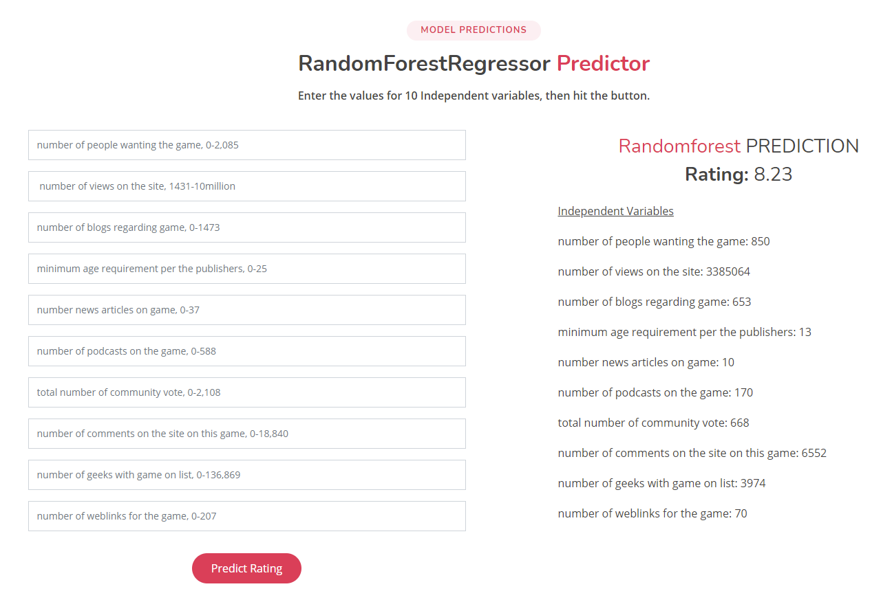

# ML on board game ratings

We explored the BoardGameGeek dataset. Using machine learning, we predict board game ratings based on 10 independent variables. 

## Exploratory data analysis (EDA)

## Feature Selection

Features were selected based on correlations of independent variables. 

The top 10 features are number of people wanting the game, number of views on the site, number of blogs regarding game, minimum age requirement per the publishers, number news articles on game, number of podcasts on the game, total number of community vote, number of comments on the site on this game, number of geeks with game on list, number of weblinks for the game. 

The feature importance were plotted in a pie plot using random forest regression.

## ML Models

The csv file contains 29,000+ board games, each has 50+ attributions. We cleaned the data by remove duplicates, null values, and invalid data. The data was then scaled by maxminscalar or standardscalar. We used 100% of the data to train. For each machine learning model, we create the GridSearchCV estimator along with a parameter object containing the values to adjust. The result is shown below.

- [sklearn.ensemble.RandomForestRegressor](https://scikit-learn.org/stable/modules/generated/sklearn.ensemble.RandomForestRegressor.html?highlight=regressor#sklearn.ensemble.RandomForestRegressor)  Explained Variance Score: 0.93451, R2 Score: 0.93450

- [sklearn.neural_network.MLPRegressor](https://scikit-learn.org/stable/modules/generated/sklearn.neural_network.MLPRegressor.html?highlight=regressor#sklearn.neural_network.MLPRegressor)  Explained Variance Score: 0.52960, R2 Score: 0.52941

- [sklearn.neighbors.KNeighborsRegressor](https://scikit-learn.org/stable/modules/generated/sklearn.neighbors.KNeighborsRegressor.html?highlight=regressor#sklearn.neighbors.KNeighborsRegressor) Explained Variance Score: 0.50760, R2 Score: 0.50689

- [sklearn.svm.SVC](https://scikit-learn.org/stable/modules/svm.html#regression) Explained Variance Score: 0.45471, R2 Score: 0.45446

- [sklearn.ensemble.AdaBoostRegressor](https://scikit-learn.org/stable/modules/generated/sklearn.ensemble.AdaBoostRegressor.html?highlight=regressor#sklearn.ensemble.AdaBoostRegressor) Explained Variance Score: 0.39258, R2 Score: 0.33835

- [sklearn.neighbors.RadiusNeighborsRegressor](https://scikit-learn.org/stable/modules/generated/sklearn.neighbors.RadiusNeighborsRegressor.html?highlight=regressor#sklearn.neighbors.RadiusNeighborsRegressor) bad fitting, wrong model

  

| **Regression** Score | metrics link                                                 |
| -------------------- | ------------------------------------------------------------ |
| ‘explained_variance’ | [`metrics.explained_variance_score`](https://scikit-learn.org/stable/modules/generated/sklearn.metrics.explained_variance_score.html#sklearn.metrics.explained_variance_score) |
| ‘r2’                 | [`metrics.r2_score`](https://scikit-learn.org/stable/modules/generated/sklearn.metrics.r2_score.html#sklearn.metrics.r2_score) |

## ML Prediction

The model predictions take 10 values from the form and gives results on the right.

## Future Work

Improve model accuracy by test train split and selection of features.

