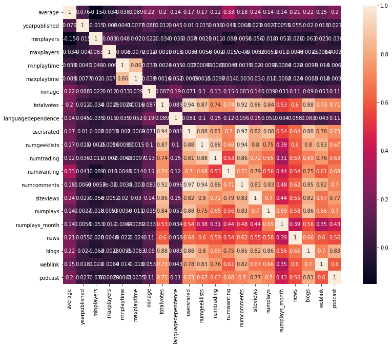

# ML on board game ratings

We explored the BoardGameGeek dataset. Using machine learning, we predict board game ratings based on 10 independent variables. 

## Exploratory data analysis (EDA)

## Feature Selection

- [sklearn.svm.SVC](https://scikit-learn.org/stable/modules/svm.html#regression)
- [sklearn.ensemble.AdaBoostRegressor](https://scikit-learn.org/stable/modules/generated/sklearn.ensemble.AdaBoostRegressor.html?highlight=regressor#sklearn.ensemble.AdaBoostRegressor) 
- [sklearn.ensemble.RandomForestRegressor](https://scikit-learn.org/stable/modules/generated/sklearn.ensemble.RandomForestRegressor.html?highlight=regressor#sklearn.ensemble.RandomForestRegressor) 
- [sklearn.neighbors.KNeighborsRegressor](https://scikit-learn.org/stable/modules/generated/sklearn.neighbors.KNeighborsRegressor.html?highlight=regressor#sklearn.neighbors.KNeighborsRegressor) 
- [sklearn.neighbors.RadiusNeighborsRegressor](https://scikit-learn.org/stable/modules/generated/sklearn.neighbors.RadiusNeighborsRegressor.html?highlight=regressor#sklearn.neighbors.RadiusNeighborsRegressor)
- [sklearn.neural_network.MLPRegressor](https://scikit-learn.org/stable/modules/generated/sklearn.neural_network.MLPRegressor.html?highlight=regressor#sklearn.neural_network.MLPRegressor) 
- [sklearn.tree.DecisionTreeRegressor](https://scikit-learn.org/stable/modules/generated/sklearn.tree.DecisionTreeRegressor.html?highlight=regressor#sklearn.tree.DecisionTreeRegressor) 

  

| **Regression**       | metrics link                                                 |
| -------------------- | ------------------------------------------------------------ |
| ‘explained_variance’ | [`metrics.explained_variance_score`](https://scikit-learn.org/stable/modules/generated/sklearn.metrics.explained_variance_score.html#sklearn.metrics.explained_variance_score) |
| ‘r2’                 | [`metrics.r2_score`](https://scikit-learn.org/stable/modules/generated/sklearn.metrics.r2_score.html#sklearn.metrics.r2_score) |